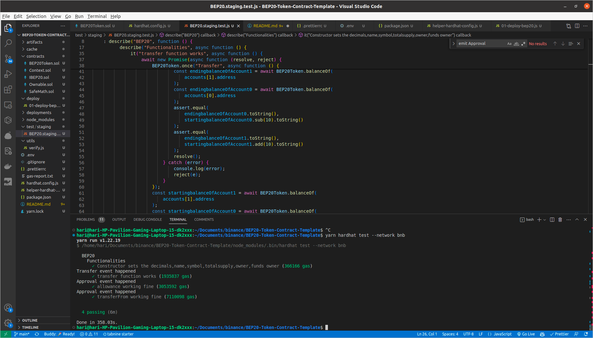

# BEP20-Token-Contract-Template

Binance Smart Chain (BEP20) Token Template

A BEP20 token must implement the interface `IBEP20` in [IBEP20.sol](https://docs.binance.org/smart-chain/developer/IBEP20.sol). This is a template contract [BEP20Token.template](https://docs.binance.org/smart-chain/developer/BEP20Token.template). Users just need to fill in `_name`, `_symbol`, `_decimals` and `_totalSupply` according to their own requirements:

    constructor() public {
        _name = {{TOKEN_NAME}};
        _symbol = {{TOKEN_SYMBOL}};
        _decimals = {{DECIMALS}};
        _totalSupply = {{TOTAL_SUPPLY}};
        _balances[msg.sender] = _totalSupply;
        emit Transfer(address(0), msg.sender, _totalSupply);
    }

Then users can use [Remix IDE](https://remix.ethereum.org/) and [Metamask](https://docs.binance.org/smart-chain/wallet/metamask.html) to compile and deploy the BEP20 contract to BSC.

Credit : https://docs.binance.org/smart-chain/developer/BEP20.html

## Extended functionalities

-   Integrated hardhat for deploying and testing contract
-   Automated testing of the basic features of BEP20 token
-   Simple verificaton of code using verify script which verifies the contract during deployment.

## Installation

Install BEP20-Token-Contract-Template

```bash
  git clone https://github.com/krishnadude98/BEP20-Token-Contract-Template
  cd BEP20-Token-Contract-Template
```

Install Dependencies

```bash
  yarn install
```

Setup .env file

```
PRIVATE_KEY="[PRIVATE_KEY1_FOR_DEPLOYMENT]"
PRIVATE_KEY2="[PRIVATE_KEY2_FOR_STAGING_TEST]"
COIN_MARKET_CAP_API_KEY="[YOUR_KEY]"
BNB_API_KEY="[YOUR_BNB_EXPLORER_KEY]"
```

## Running Tests

To run staging tests, run the following command

```bash
  yarn hardhat test --network bnb
```

## Deployment

To deploy this project and verify the contract run

```bash
  yarn hardhat deploy --network bnb
```

## Deployed Instance

`https://testnet.bscscan.com/address/0x53fb001A7356CfA932c0e7e0f692F80f620F4b44`

## Document

[LINK](https://docs.google.com/document/d/11TZ4509YD39YMUwJQiO7cCi9xpO_oMhzPkC9ltEHAeE/edit?usp=sharing)

## Environment Variables

To run this project, you will need to add the following environment variables to your .env file

`PRIVATE_KEY`

`PRIVATE_KEY2`

`COIN_MARKET_CAP_API_KEY` used for cost calculation(Dollars)

`BNB_API_KEY` for verifying

## Screenshots


